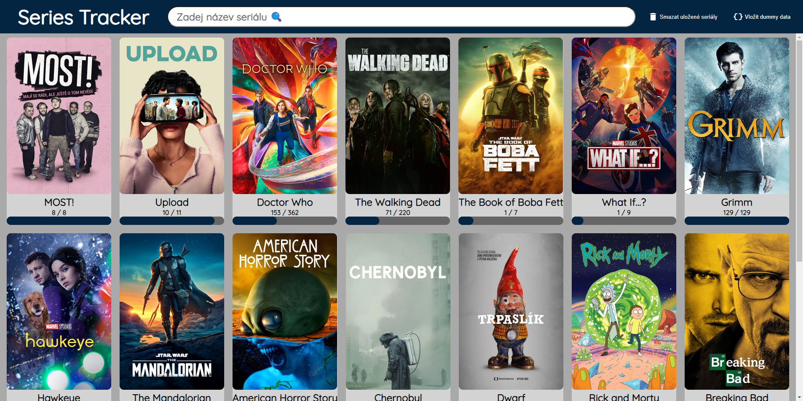
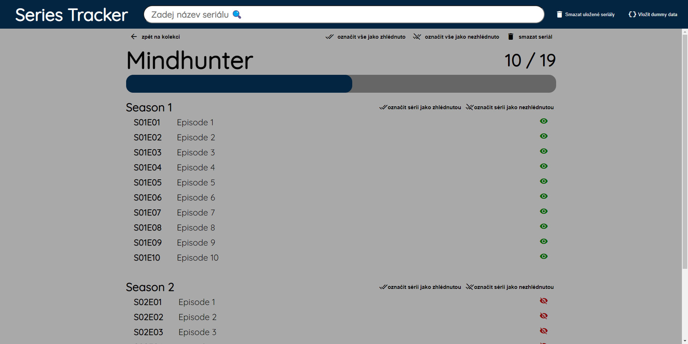

# series-tracker :film_strip:
Web application for tracking progress of watching any TV series.

Written in HTML, CSS and JavaScript. 
Data about TV shows are obtained via AJAX requests from [The Movie Database](https://www.themoviedb.org/). 
Added TV shows and marked episodes are saved into browsers local storage.

[Demo of the application](https://vojtechnerad.github.io/series-tracker/app)

### Collection - frontpage of the application

After adding show to the collection, it will be displayed on the frontpage of application as a card with name, poster and watching progression.

### TV show details

TV show details contais about each episode - its name, number and name. 
Each episode card doubles as clickable checkbox for marking episode as seen. 
The details also shows percentage of seen episodes.
